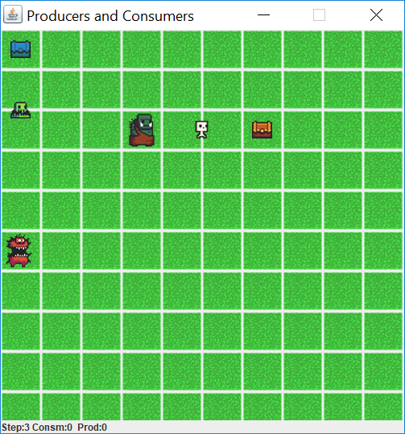
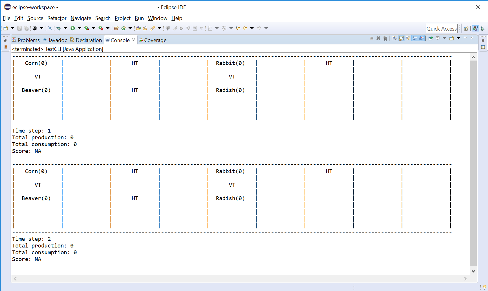
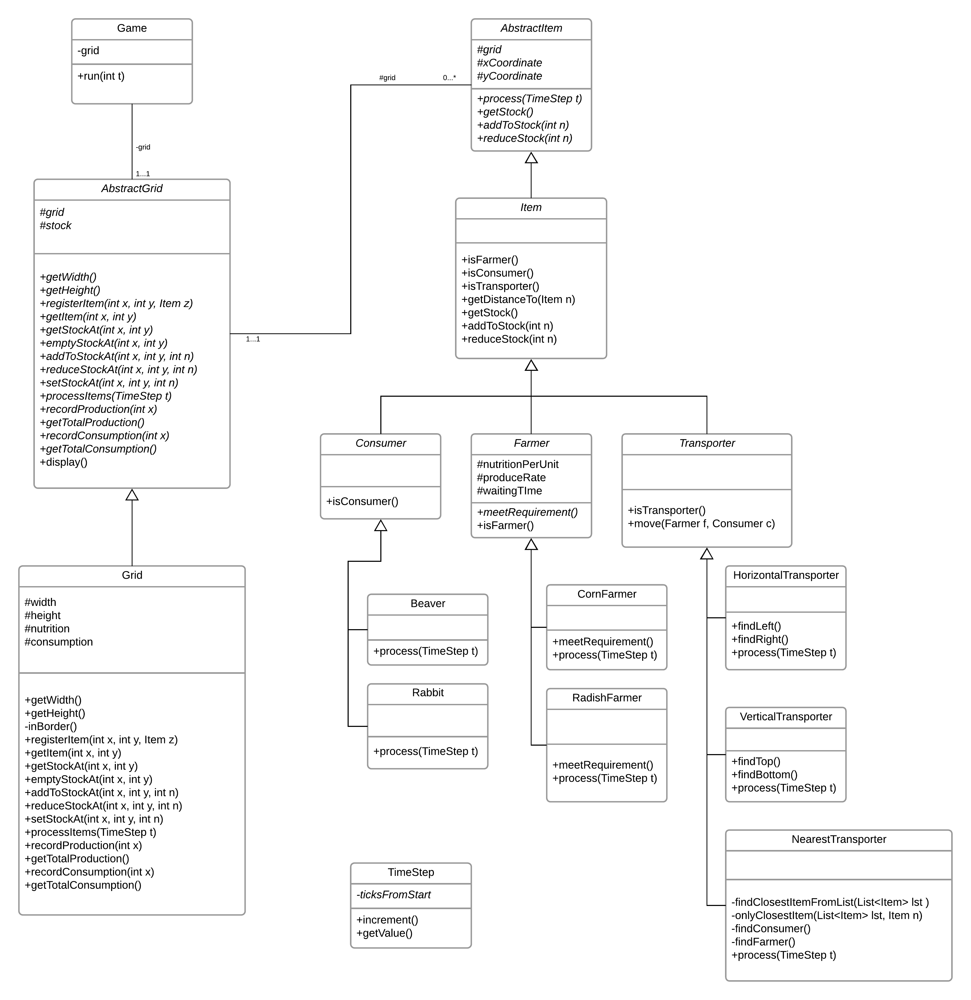

# Producers and Consumers
A simple single-player strategy game. It is played on a rectangular grid having a goal to maximize the score. Before the game
starts, the player places items on the cells of the grid. There are both command-line interface and graphical user interface.

<p align="center">
  
</p>
<p align="center"><i> an example GUI</i></p>


The game consist of 3 components: 
  * Farmers: producing food
  * Transporters: carrying the food to the consumer
  * Consumers: consuming the food

When the game starts, all items will do their job within thier own conditions.

At each time-step, the items will work in the following order: *all farmers, all transporters and all consumers starting from top-left, processing a row completely before moving to the next row*

Once the game is started, the game will runs automatically and produces a **final score** without the player interaction. The score is calculated by the number of products consumed divided by products produced.

## Farmer
#### Corn farmers
	* Require 2 spaces to their left and right and 1 space below and above where there are no other farmers. If this condition is not met, they do not produce anything.
	* Produce 5 corns every 4 time-steps. 
	* Each corn provides 5 units of nutrition.

#### Radish farmers
	* Require no adjacent farmer next to them. If this condition is not met, they do not produce anything.
	* Produce 10 radishes every 3 time-step. 
	* Each radish provides 1 unit of nutrition.

## Transporters

#### Horizontal transporters
	* Move products between a farmer and a consumer when they are placed on **the same row** and between the two.
	* If they are not placed correctly, they do not carry anything.
	
#### Vertical transporters
	* Move products between a farmer and a consumer when they are placed on **the same column** and between the two.
	* If they are not placed correctly, they do not carry anything.

#### Nearest transporters
	* Move products between the nearest farmer to it and the nearest consumer to it.
	* If there is ambiguity about which farmer or consumer to choose, they do not carry anything
	
## Consumers
#### Rabbits
	* can consume up to 8 units of nutrition at each time-step.
	* If they are delivered any more than 8 units, they cannot save the products for later consumption.
	* The excess is wasted.
#### Beavers
	* can consume up to 5 units of nutrition at each time-step.
	* They can store up to 50 units for later consumption
	* Any more than 50 units will be wasted.


It is an part of [CS5001](https://info.cs.st-andrews.ac.uk/student-handbook/modules/CS5001.html) at University of St. Andrews.


<p align="center">
  
</p>
<p align="center"><i> an example CLI</i></p>

## Implementation



## How to play
A player write Test.java as an example below. Then, run and see your own score. Other examples are [TestCLI.java](src\core\TestCLI.java) and [TestGUI.java](src\core\TestGUI.java)

```javapackage core;

import core.gui.*;
import core.game.*;
import java.awt.EventQueue;

public class Test {
	public static void main(String[] args) {
		Grid grid = new Grid(10, 10);
        new CornFarmer(grid, 0, 0);
        new Beaver(grid, 0, 5);
        new Rabbit(grid, 3, 2);
        new RadishFarmer(grid, 6, 2);
        
        ///Transporter have to be the last object
        new HorizontalTransporter(grid, 0, 1, 10);
        new VerticalTransporter(grid, 5, 2, 10);
        Game game = new Game(grid);
        
        EventQueue.invokeLater(() -> {
            Application ex = new Application(game);
            ex.setVisible(true);
        });
    }
}
```

-------------------------

## Library
* Swing (Java)

## Resource
* So sorry I forgot. I promise to trace back to give a credit to the cute images I used.

## Todos
 * Make it moves precisely under each time-step.
 * Implement algorithm to find the best map setup that maximize the score; fixed resources and time-step.
 * Analyse changing rate of score in particular setting.

## Author
[Pakawat Nakwijit](http://curve.in.th); An ordinary programmer who would like to share and challange himself. It is a part of my 2018 tasks to open source every projects in my old treasure chest with some good documentation. 

## License
This project is licensed under the terms of the MIT license.

